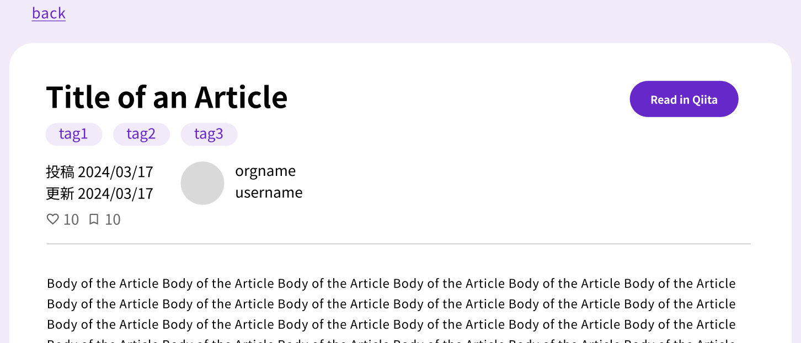
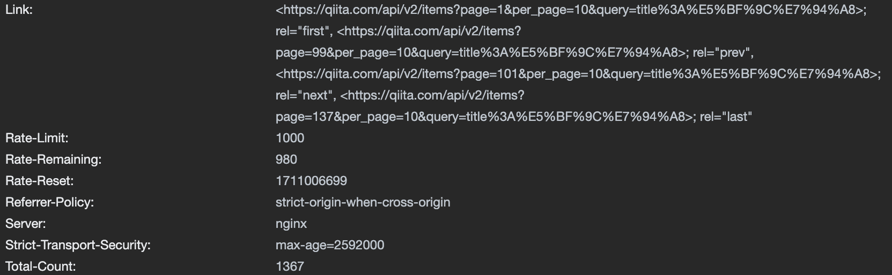
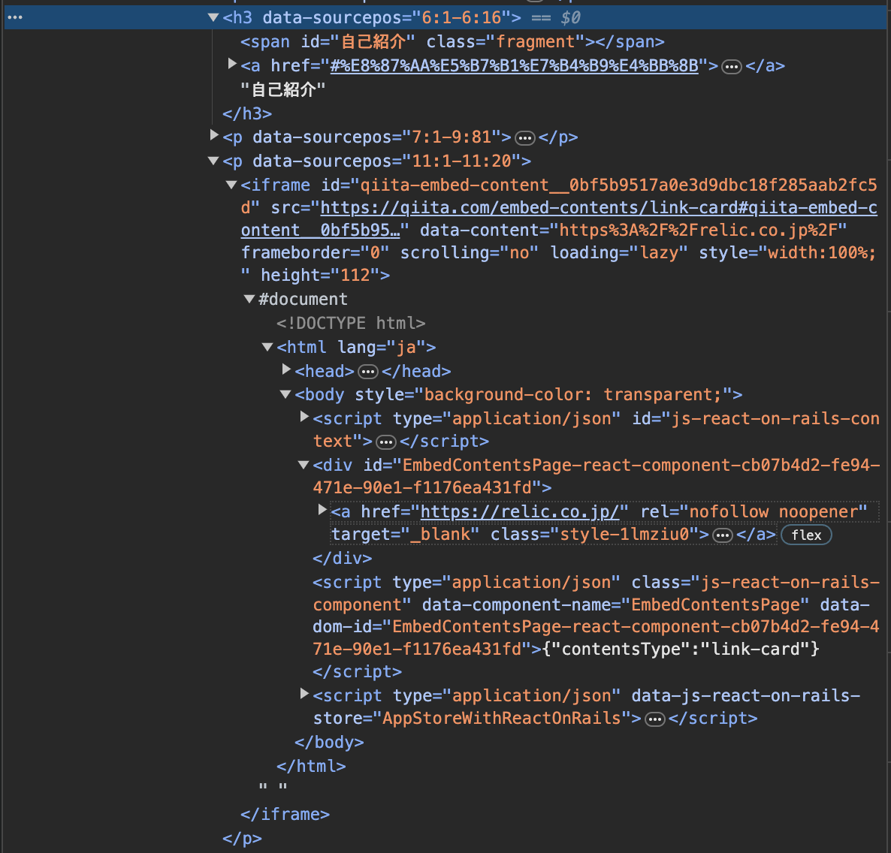
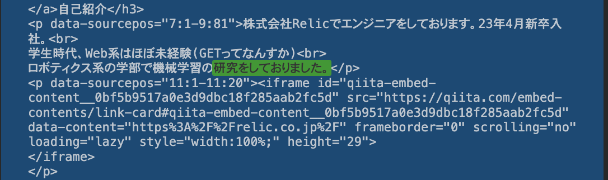

開発過程の検討事項・tips・試行錯誤などを綴っています。基本的には時系列で思ったことを思ったときに書いているので、まとまりのない文章になります。

# 3/16

## nodeのアップグレード

### 背景

yarnを使うにはnodeのバージョンが18.17.0以上である必要があった

`You are using Node.js 16.14.0. For Next.js, Node.js version >= v18.17.0 is required.`

### 方針

nvmを使用してnodeをアップグレード

### 手順

nvmをインストール

```bash
curl -o- https://raw.githubusercontent.com/nvm-sh/nvm/v0.39.5/install.sh | bash
```

インストール検証

```bash
command -v nvm
```

インストールできていないっぽい(`nvm command not found`)のでシェルを確かめて変更を反映

```bash
echo $SHELL
source ~/.zshrc
```

安定版のnodeをインストールして設定

```bash
nvm install 20.11.1
nvm use 20.11.1
```

### 参考

https://qiita.com/takokke/items/df01818d65a0d4b1da90

https://qiita.com/ffggss/items/94f1c4c5d311db2ec71a

## commitlintのインストール

### 背景

開発体験向上

### 手順

commitlintのインストール

```bash
# mac
yarn add @commitlint/{config-conventional,cli}
```

huskyのインストール

```bash
yarn husky install
```

ルートにcommitlint.config.jsを作成し、コミットメッセージのフォーマットを設定

```bash
cat > commitlint.confing.js
```

.husky/commlit-msgの内容を以下に書き換え

```bash
#!/usr/bin/env sh
. "$(dirname -- "$0")/husky.sh"

yarn commitmsg
```

.husky/husky.shを以下に書き換え

```bash
省略
```

package.jsonの”scripts”に以下を追加

```json
"commitmsg": "commitlint -e $GIT_PARAMS",
```

### その他

ワークディレクトリを書き換えずに直前のコミットを取り消す

```bash
git reset --soft HEAD^
```

### 参考

https://zenn.dev/kalubi/articles/27fa889c338cdf
https://zenn.dev/tingtt/articles/b7482fb829ce39
https://qiita.com/shuntaro_tamura/items/06281261d893acf049ed

## Storybookの下調べ

コンポーネントの挙動確認のためのツール。
<br>
デザインとかを確認したり調整したりするためのものなので、一通りアプリの骨組み作りが終わったあとで実装する。

### 背景

開発効率向上

### 参考

https://zenn.dev/chris_d_k/articles/a9a05e963c11cd

## Qiitaの検索機能

Qiitaでは記事を検索する際にオプションを組み合わせることで、タイトルや記事の内容・投稿日時、ユーザなどを細かく指定できる。APIを用いた記事の一覧取得においても同様にオプションを適用できる。

本アプリにおいてもすべての検索オプションに対応したい。ただしUXの観点から、使用頻度の高そうなオプションのみデフォルトで一覧表示画面から設定できるようにし、その他の細かいオプションについては「詳細な条件を設定」のようなボタンを押下してモーダルを表示する形式で実装する。

この検索条件の設定について、とりあえず`feat-home-structure`ブランチでは一覧表示画面に仮のテキストボックスを一つだけ配置しておく。モーダルの実装は行わない。

## formタグについて

フォーム作るときって必ずformタグで囲まなきゃダメだっけ？
https://chat.openai.com/share/ce301ac2-ffe0-4e09-92fc-36edb4a225d4

囲まなきゃいけないっぽいけど、詳細検索のモーダルはどうしよう。formタグ内に詳細検索モーダルのコンポーネントを配置して、なんかの変数(`isOpenDetails`みたいな)の値によってモーダルを表示するかどうか切り替えればいいかな。

## fetchした記事の型定義

`/api/v2/items`でfetchした記事オブジェクトの型定義が面倒そうだったが、[オブジェクトから型を自動生成してくれるツール](https://jvilk.com/MakeTypes/)で解決

## 今後の流れ

- 記事タイトルで記事の検索ができる
- 詳細表示画面で記事の詳細情報が見れる
- 任意のAPIキーを入力してAPIを叩く(現状は環境変数に設定したキーを用いている)
- APIキーが未入力の場合は何かしら通知する
- Recoilを用いた状態管理

以上四点の実装を最初の目標にする。これを達成したら一旦`main`にマージする。

状態管理は今まで`useProvider`を用いた実装しか経験したことがない。とりあえず最初はRecoilを用いた実装にチャレンジしてみて、厳しそうだったら一旦前者にしておく。開発期間が二週間あって割と長いので最後に余裕があったら後者に再チャレンジする。でも一旦前者で実装したのを後者に書き直すのは手間がかかりそう...

その後は、Storybook, CSS(SASS), MUIを用いてUIを作り込む。いい機会なのでSASSの構文を勉強したい。

Storybookは使ったことがないのでゼロから勉強することになる。ざっと調べた感じだと一つのコンポーネントに対して一つのStorybookファイル(`xxxx.stories.tsx`)を作り、細かいデザインを指定したりするっぽいという理解。<br>GUIでコンポーネントの挙動やPropsを確認したりできるのがメリットらしいけど今のところ面倒くさそうという印象。メリットを十分に理解できていない。

最低限の機能＆デザインの実装が終わったら

- リファクタ
- ホスティング(vercel)
- 詳細検索

の順で実装。リファクタは念入りに行う。ついでにuseEffectとかuseCallbackとかのhooksについてしっかり理解しておく。

ユーザとのチャットを基にいい感じの記事を自動で検索してくれるチャットボット機能を生成AIのAPIを用いて実装しても面白そう。でもあんまり技術的にアピールできる要素が少ない気がする。

あとはfirestoreを使って過去に検索した条件などを保存するとか。その場合はユーザが本アプリにアクセスした際にCookieに適当なIDを保存しておいて、そのIDでユーザを識別する。ただしCookieの安全な管理は正直あんまり理解できていないしネットワーク系の知識もないので、下手な実装をしてボロを出すリスクを考えたほうがいいかも。

## Recoil

インストール

```bash
yarn add recoil
```

stateディレクトリ内のxxxState.tsで状態を定義する。思ったよりシンプルで簡単そう。

state定義のファイルはどういう単位で分割するのがいいのだろう。一つのファイルにつき一つのrecoil/selectorを定義するのが良いのか、例えば記事一覧表示画面に関係するものはすべて一つのファイル内で定義するのが良いのか。
https://chat.openai.com/c/62771726-35b3-4616-87d4-4b0a46909505

とりあえず前者の方針でいく。膨らんできたらまとめる。

selectorを使うと関数のメモ化や計算処理の分離ができる。リファクタのときに念頭に置いておく。

### 参考

https://zenn.dev/mostlove/articles/9ee8640b4d9ae9

## 正規表現

英大文字・英小文字・数字・アンダースコアのいずれかの1文字以上の繰り返しにマッチする正規表現は

```
/^\w+$/
```

このとき`^`(文字列の開始)と、`$`(文字列の終わり)をつけることで、`\w`のみで構成される文字列とマッチする。仮にこれら２つをつけないと、「3hlああ8g8s」のような文字列ともマッチする。(対象となる文字列のどこか一部に正規表現を満たす部分が存在すれば良いから)

## Storybook再考

もうちょっと調べた結果、結構便利かもしれない。ただ短期の個人開発だとあまり恩恵を受けることはできなさそう。とりあえずテストとして`Circle.tsx`を作って使い方を簡単に確認する。SASSと組み合わせて使えるかどうかなども検証。

### 手順

`src/stories/`ディレクトリに`[コンポーネント名].tsx`と`[コンポーネント名].stories.tsx`を作成。

コンポーネントはすべて`stories`ディレクトリで定義するっぽい。

Propsなどで動的に変わる要素以外はsassファイルに定義して良さそう。

### 参考

<https://www.youtube.com/watch?v=D52gjW9T3YM>(プライベートブラウザで開くこと)

## デザイン作成

[figma](https://www.figma.com/file/PWNYfomzX4y31fwN8jpBqH/I-love-Qiita?type=design&node-id=0%3A1&mode=design&t=8dJ9ebFsT5sUQyd1-1)でデザイン作成する。

レスポンシブ対応も後々する。優先度は低い。

まずはデザインシステム作ったあとでモックアップを作成する。

デザインシステムは[デジタル庁のデザインシステム](<https://www.figma.com/file/NCAqaM8jcWtd54ovH8TXXq/Design-System-1.4.1-(Community)>)を参考にしつつ作成したい。ここまでがっちり定義する必要はないので使う色やフォントの定義、ボタンやテキストエリアなどの基本的なUIコンポーネントのデザインが作成できれば良い。デザインのセンスはないのでAIに頼りたいところだが、webページのデザイン作成に特化したものはあるのかな...

# 3/17

## デザイン

デザインシステムはとりあえず色の定義とボタンコンポーネントのテンプレだけ作成した。他のUIパーツは原則MUIを利用する(色だけ紫に変える)。

一覧表示画面の検索フォームのデザインで悩む。将来的に「詳細検索」と「AIコンシェルジュ」は実装したいのでこれらの導線となるボタンを設置したいが以下の２つの案がある。

1. それぞれアイコンボタンにして検索テキストボックス内の右端に配置
2. テキストボタンにして検索テキストボックスの下に配置

1だとUIはスッキリするがアイコンだけど見てその機能を即座に認識しにくくなる可能性があり、UXの観点で劣る。2だとボタンの機能は明快だが冗長で洗練されていない印象。

1の方が若干めんどくさいのでとりあえず実装して、最終的に2にするかどうか判断する。

記事パーツの著者のアイコン・名前・組織名の配置に悩む。アイコンのどの部分を基準として２つの名前を配置しようか。

APIキーの設定ボタンを追加し忘れていた。アイコンが3つになったのでこれらをテキストエリアと検索ボタンの間に配置する。ただしAPIキーの設定は必須の操作である割には所見で設定方法が分からずUXが悪いのでガイドのテキストを何らかの形で表示する。

## 記事一覧のページング

完全に忘れていた。とりあえず表示するときは10件単位でページングする。

検索の結果該当する記事数が非常に大きな数になる場合を考慮した上での、一度の検索での記事の取得方法は以下の二通り。

1. 一度に取得できる最大数の記事(page=100, per_page=100で10000件)を取得する
2. 一度に取得できる記事の最大数をある程度に制限して、ページングの結果取得範囲外の記事にアクセスする必要がある場合はページングボタンが押された際に再度記事一覧を取得する

1だと実装は比較的楽だが検索・フロントエンドでの処理に時間がかかる可能性がある。該当記事数が10000を超える場合(そうそうないと思うが)は結局2と同じようなことをしなければならない。<br>2だと実装はかなり面倒くさいが、処理は比較的軽いはず。必要以上にAPIを消費しないようにするという観点から考えると適切なのは後者だが複雑そう...

後者の場合はLinkヘッダ(APIドキュメント参照)をうまく用いることがコツっぽい。

とりあえず後者で実装する方針でいく。ただし実装がかなり面倒くさくなりそうでモチベーションが今のところ無いので、具体的なロジックの設計含めて現状のデザイン作成作業の後に行う。

## 詳細表示画面

記事の詳細なので当然記事の本文(body)を表示したいが、bodyはmarkdown形式なのでHTMLに変換して表示する必要がある。[nextjsでmarkdownを表示できるライブラリ](https://github.com/remarkjs/react-markdown)があるが、Qiita独自のｍarkdown記法には対応していないと思われる。

独自のmarkdownをHTMLに変換するロジックを書いていたら流石に時間がない(モチベーションもない)ので変換の実装は諦める。

よくよく調べたら`rendered_body`がHTML化された記事本文だったので上のライブラリは使う必要ないっぽい。いずれにせよ、全体のデザインに合うようにフォントなど最低限のCSSを当てる処理は必要になりそう。

そういえば`rendered_body`の型はstringだからHTMLとして用いるにはどうすればいいんだっけ。個人開発でdangerouslySetInnerHTMLを使ったけどXSSのリスクがあった。Qiitaが技術記事の投稿サイトである以上、取得した記事にXSSとなりうるような形式でスクリプトが書かれている可能性は高いので何らかの処理が必要。Quiita側がエスケープ処理した状態にしてくれてたりしないかな。

表示する要素は以下

- 記事タイトル(title)
- 記事本文(rendered_body)
- 著者名(user.name)
- 所属組織名(user.organization)
- 著者のアイコン(user.profile_image_url)
- 投稿日時(created_at)
- 更新日時(updated_at)
- 記事URL(url)
- タグ(tags)
- いいね数(likes_count)
- ストック数(stocks_count)

デザイン全般に言えることだが、Qiitaと同じアプリにしても意味がない気がする...

### 参考

https://zenn.dev/hayato94087/articles/649e8d817165d8

## テキストボックス

Storybookを作り忘れないようにする

一箇所しか使わないからinputタグのwidth/heightをpxで指定したけど、少なくともwidthは100%にして、親要素のwidthで幅を調整したほうが良いかも。

## 記事一覧

検索したワードと一致する部分は紫でハイライトしたら面白そう

# 3/18

## Storybook

なんかエラーになるので一旦放置。リファクタ終わった後とかにまた考える。

## ArticleCardコンポーネント

カードの右側のテキスト部分はどうしよう。プレビューとして記事の冒頭だけ表示させるつもりだったけどコードとかをそのままテキストとして表示するとぐちゃぐちゃになる。生成AIを使って記事の要約をテキストにすればいいと思ったけどAPIのレスポンス時間が課題。1ページの10本の記事すべての要約を取得するのにはそこそこの時間がかかりそう。前に落合陽一が応答がめちゃくちゃ速い生成AIをTwitterで紹介してた気がするけどツイート多すぎて遡れない。

記事を一つずつAPIに投げて、要約が一つ生成されるたびに何らかのカウンター的な変数を更新してプログレスバーにその分反映させればUX的にも耐えるかな？流石にローディングサークルが使える長さじゃないと思う。

一旦右のテキスト部分は適当な文字列を置いておく。ただ一覧表示画面の目玉的な機能になるので他の基本的なデザインが完成し次第リファクタよりも前に優先的に取り組みたい。

## Imageコンポーネント

srcに指定する画像URLのホストのホワイトリストを`next.config.mjs`の`images/remotePatterns`で定義しなきゃいけないっぽい。

記事の著者のアイコンのURLが何種類あるかわからない。

## 記事一覧画面のデザイン

組織名がない場合に著者名の配置をアイコンの縦中央にする

タイトルが最大2行になることを想定しているが3行以上になったら表示が崩れる

bodyに謎のマージンがある問題。`globals.scss`でbodyのmarginをゼロに設定して解決。h1タグも同じ。

## 記事詳細画面のデザイン



3/17に箇条書きした要素をとりあえず詰め込んだデザインをfigmaに作ったけどなんか左側の情報量が多くてごちゃごちゃした印象。でもどの情報も削りにくいので上手い配置を考えたい。とりあえずこの画像のとおりにCSSを書いてみる。

## 検索フォーム

フォームをアクティブにした状態でenterを押すと再読込されるので要検証。

# 3/19

## 記事詳細画面のコード部分

プレーンテキストのまま出力されてしまうので文字はハイライトしたい。コード部分のみ`div`タグになると仮定してみる。

### 参考

https://zenn.dev/honegger/articles/ff76dbdaf9d7a9

## 今後の方針

とりあえず最低限のデザインの実装が終わったのでmainにマージする。今後はTODOなどはIssuesで管理する。

まずはAPIキーの入力フォーム(モーダル)を作成し、その後生成AIを用いた記事一覧画面の記事の要約に付いて検討し、何らかの形で実装が終わり次第リファクタという流れで行う。

## 生成AIを用いた記事要約

先述した通り、要約の生成に時間がかかるのが課題。100~200文字の要約生成なので今回は精度よりも生成速度を重視したい。[Groq](https://groq.com/)というLLMが早いらしいのでこれを使う。[LLMの性能ランキング](https://wandb.ai/wandb-japan/llm-leaderboard/reports/Nejumi-Leaderboard-Neo--Vmlldzo2MTkyMTU0)によると、精度はGPT4には劣るがそこまで悪いわけではないっぽい。

Groqだとrate limit(40,000 tokens per minute)が厳しいので断念してGPT4を利用することにする。金払うから緩和してくれないかな。

## 環境変数

GroqのAPIを叩こうとしたらエラーが出た。

```
Error: This is disabled by default, as it risks exposing your secret API credentials to attackers.
If you understand the risks and have appropriate mitigations in place,
you can set the `dangerouslyAllowBrowser` option to `true`, e.g.,

new Groq({ dangerouslyAllowBrowser: true })
```

APIキーをクライアントサイドの実行で使おうとしたのが原因らしい。環境変数の扱いについてよく理解できていなかったので[公式ドキュメント](https://nextjs.org/docs/pages/building-your-application/configuring/environment-variables)を読んで理解しておく。

## 要約生成の非同期処理

だいぶ苦労した。非同期処理については正直あまり理解できていないので要復習。とりあえず`Promise.all`を用いて`index.tsx`内で一括で要約を取得するくらいしか上手い解決策が思いつかなかった。プログレスバーとの兼ね合いで要約取得の進捗状況をカウンタ変数で取得したかったがこの方法だと実現不可能。

正直要約したテキストを一覧表示画面に表示せずとも、詳細画面で記事本文の代わりに記事の要約を表示すればいい話ではある。本文が読みたかったらQiitaを見ればいいので...

進捗の把握は非同期処理の実装方法を考え直す必要があるので一旦`Promise.all`を使う方針で妥協。ローディング中のUIをどうするかが問題になる。先述したようにロードがそこそこ長くなるのでローディングサークルはできれば避けたいが、進捗状況を示すことはできない。代替案として、初めはローディングサークルを表示し、一定時間が経過したらスケルトンスクリーンを用いることで体感の待機時間を軽減する策が有効かも。場合によっては間に「読み込みに時間がかかっています」みたいなメッセージを表示してさらに段階を踏むとかもあり。

### 参考

https://zenn.dev/kii/articles/progress-indicator-ui
https://uxmilk.jp/57894

## AbstractとSummaryのニュアンスの違い

https://chat.openai.com/share/1ac7e4c0-79c5-448d-bd10-51abf1a2c80d

今回の文脈だとどっちでも良さそう。summaryでいいかな。

## 今後の方針

記事の要約生成が一段落したのでリファクタを進める。とりあえず[関数のメモ化](https://github.com/inckayu/I-love-Qiita/issues/21)と[環境変数の取り扱い](https://github.com/inckayu/I-love-Qiita/issues/24)以外のissuesをすべて解決したところでリファクタ完了にする。その後は

- ページング
- AIコンシェルジュ
- 詳細検索機能
- 検索に一致する部分のハイライト
- 過去の検索条件の保存
- ホスティング
- レスポンシブ対応
- 音声検索(Whisper API & LLM)

の順で実装。これらすべてが実装できたら完成でいいかも。終わりが見えてきた。重いタスクばかりなので頑張りたい。

# 3/20

## sass座学

### 採用ルール

基本的には[コーディングルールの参考例](https://zenn.dev/kagan/articles/1aa466bb6ef8eb)から必要なものを抜粋。必要性が低いものや自明なものは省略。

- stylelintの使用
- クラスの命名規則はBEMに基づく(「」を参照)
- クラス名をアンパサンドでネストしない
- マージンはtopまたはleftでつける
- プロパティのシュートハンドは避ける
- フォーカス時のoutlineを消さない(デザイン作成する)
- フォントサイズの単位はpxではなくremにする(rootを10pxにする)
- PCのメディアクエリにはprintをつける
- 共通パーツにはmarginやwidthを指定しない

### ミックスイン

定義した関数を利用する機能。

```scss
// 関数定義
@mixin func($prop) {
  font-size: $prop;
}

// 定義した関数を使用
div {
  @include func(1rem);
}
```

### 拡張・継承

セレクタを使い回す。

```scss
// %をつけるとコンパイルしたときに出力されないので原則つける
%a {
  width: 100px;
  height: 100px;
  background-color: #ff0000;
}

div {
  @extend a;
}
```

### パーシャル

2022年10月に`@import`が廃止された。以降は基本的に`@use`と`@forward`を用いる。

#### @use

変数の使用には名前空間を明示(`[名前空間].$[変数名]`)する必要がある。明示することにより読み込んだファイル同士での変数名の衝突を防止できるが、今回の開発では重複するような名前はない(重複しうるほど複雑・大規模ではない)ので原則として名前空間は省略する。

```scss
@use 'directory' as 名前空間;

// 名前空間を省略
@use 'directory' as *;
```

`@use`で読み込んだファイルは、他のファイルで読み込むことができない。

```sass
-style.scss
-sass
├ _variables.scss ├ _utility.scss
└ _index.scss
```

このようなディレクトリ構造の場合

```scss
/* sass/variables.scss */
$color: #000000;

/* sass/index.scss */
@use 'variables' as var;

/* style.scss */
@use 'sass' as sass; //_indexの読み込みは省略可
.foo {
  color: sass.$color; //コンパイルエラー
  color: sass.var.$color; //コンパイルエラー
}
```

`sass/variables.scss`の中身は`sass/index.scss`でしか利用できない。

#### @forward

上の例において、`sass/variables.scss`の中身を`style.scss`でも利用するためには、`sass/index.scss`で`@use`ではなく`@forward`を用いる。ハブに利用するイメージ。

### ファイル名のアンダーバー(`_`)

コンパイルした際にそのCSSファイルを出力させない。

### 参考

- [Sass Basics](https://sass-lang.com/guide/)
- [Stylelint](https://stylelint.io/)
- [Bootstrap](https://getbootstrap.jp/docs/5.0/layout/breakpoints/)
- [コーディングルールの参考例](https://zenn.dev/kagan/articles/1aa466bb6ef8eb)
- [ミックスインのテンプレ](https://zenn.dev/tak_dcxi/articles/2cc1828e9c1fe2)

Sassのドキュメントを自動で作ってくれる[SassDoc](https://github.com/SassDoc/sassdoc)というライブラリがあるらしいが、最終更新が4年前なので要検証。

## sanitize-html

インストールは型も含めてする必要あり

```zsh
yarn add sanitize-html
yarn add @types/sanitize-html
```

## stylelint

導入方法をREADMEに書く

## lint-staged

commitしたときにeslintを発動させる。

インストール

```zsh
// 開発環境でのみ必要なので-Dコマンドをつける
yarn add lint-staged -D
```

`.husky/_/commit-msg`に`yarn lint-staged`を追加

```commit-msg

#!/usr/bin/env sh
. "$(dirname -- "$0")/husky.sh"

++ yarn lint-staged
yarn commitmsg
```

package.jsonを編集

```package.json
"lint-staged": "eslint --ext .ts,.tsx src --cache --fix"
```

## GitHub Flavored Markdown (GFM)

https://docs.github.com/ja/get-started/writing-on-github/getting-started-with-writing-and-formatting-on-github/basic-writing-and-formatting-

# 3/21

## stylelint

廃止されたルールがunknown ruleになる。[公式ドキュメントのMigrationのページ](https://stylelint.io/migration-guide/to-16)で`Deprecated stylistic rules`に載っているものは使えない。`extends`で外部のルールセットを使う場合にDepreatedとなったルールが含まれていることがある。

API入力フォームでテキストボックスに適当な値を入力してボタンを押さずにモーダルを閉じたときのstateってどうなってたっけ？

## 正規表現を用いた置換

VSCodeで正規表現を用いてフォントの単位を修正したい。

```example
font-size: 12px; -> font-size: rem(12);
```

置換の際に、数字をそのまま置き換えるためには、以下のように括弧で囲んで`$`で参照する。

```
font-size: (\d{2,})px; -> font-size: rem($1);
```

## 今後の方針

ちょっとモチベがあまりにもないので[コンポーネントのStorybookの作成](https://github.com/inckayu/I-love-Qiita/issues/17)と[Jestの導入](https://github.com/inckayu/I-love-Qiita/issues/34)は最後にやろうかな...最後にJest導入してもあまり意味がないけど。

## ブラウザのディベロッパーツール

consoleやhtml/cssを確認するくらいにしか使ってなかったけど、他の機能はよく知らなかったので座学。

https://qiita.com/d-dai/items/0b580b26bb1d1622eb46

## Qiita APIのレスポンス


`Total-Count`の値が1367になっている。リクエストのパラメータ`page=100 * per_page=10 = 1000`を上回っているから多分記事の総数を返すという認識で大丈夫そう。

`Link`ヘッダを見ると、`rel='last'`のリンクが`page=137`になっている。`page=137 * per_page=10 = 1370 = Total-Count / 10 + 1`なので全記事取得できる。

今気づいたが、`page`パラメータの意味を理解できていなかった。`page=n`は検索条件に合致するすべての記事のうちのnページ目を取得するという意味。

ページングはAPIの設計のおかげで思ったより簡単に実装できそうだが、`Link`ヘッダと`Total-Count`ヘッダの取得方法がわからない。`fetchArticles`のレスポンスをコンソールに表示してもこれら2つがない。おそらくCORSポリシーのせいでjavascriptからアクセスできない。とりあえず`page`パラメータを用いてページングを行い、存在しない`page`にアクセスしてエラーが起きたらエラーハンドリングで対処。余裕があったらSSRを試してみる。(上の画像をよく見たら`Referrer-Policy`にそれっぽいこと書いてある)

## 詳細検索の内容・仕様

- タイトル部分一致(実装済み)
- 本文部分一致
- 空白区切りでOR検索
- タグ(UIはdatalist)
- タグはAND検索のみ
- 含まないタグ
- 作成日時のレンジ
- 更新日時のレンジ

詳細検索を使わずにメインボックスから検索した場合との整合性を取るためにメインテキストボックスと同様の機能のテキストボックスを詳細検索モーダルにも設置する。これら２つは連動させる。フォームの内容を基にクエリを生成する。メインテキストボックスが空欄であっても問題はないはず。

# 3/22

## MUI AutoComplete

デザインシステムに合わせる必要があったので`useAutoComplete`を利用。`free solo`を使って任意のタグを設定できるようにしたかったが難しかったので断念。

Qiitaのタグは総数が20万個以上あるのですべてを取得するのは現実的ではない。


選択できるタグが限定されたり最新のタグを取得できないというデメリットはあるが、妥協策として全てのタグのうち記事数が高いtop1000くらいを定数ファイルに入れて利用する。

以下の手順で取得。

APIを叩くプログラムを作成。

```fetchTags.mjs
import axios from 'axios'

export const fetchTags = async (token, page) => {

  const config = {
    headers: {
      'Content-Type': 'application/json',
      Authorization: `Bearer ${token}`,
    },
  }
  const res = await axios.get(`https://qiita.com/api/v2/tags?sort=count&page=${page}&per_page=100`, config)
  res.data.forEach((tag) => {
    console.log(tag)
    console.log(",")
  })
  // return res.data
}
console.log("export const tags = [")
for (let i = 1; i <= 10; i++) {
  await fetchTags(QIITA_API_KEY, i)
}
console.log("]")
```

プログラムを実行して結果を保存。

```zsh
touch tags.ts
node fetchTags.mjs >> src/constants/tags.ts
```

# 3/23

## タグの画像

`GET /api/v2/items(/:item_id)`で取得した記事の情報にはタグの画像URLが含まれていないので記事詳細画面で`GET /api/v2/tags/:tag_id`を用いて画像を取得する必要がある。

そもそもタグの画像が必要な理由って記事作成時/記事検索時にタグを見つけやすくするためとも考えられるので、記事詳細画面で表示する必要性は低い(だから記事を取得するAPIにも画像の情報がない)のかもしれない。まあ時間に余裕はあるしそんなに難しい処理ではないので実装しておく。

## .vscodeフォルダ

VSCodeのSettingsにはUser SettingsとWorkspace Settingsの2つがあり、VSCode全体の設定は前者、プロジェクト個別の場合は後者。知らなかった...

とりあえずprettierの設定をWorkspace settingsに追記した。

## prettierが効かない

eslintとprettierでimport sortのルールが競合していたのが原因。確か競合しないようにするプラグインやエクステンションがあったような気もするが、とりあえずprettierの方のルールを削除したら解決した。

### 参考

https://qiita.com/teixan/items/dd612f13ed002528a6dd
https://qiita.com/kokogento/items/9791cdc3aef309fbbed4

## MUIの色のカスタマイズ

https://mui.com/material-ui/customization/palette/#custom-colors

## replace関数

第二引数に関数を取ることができる。

```javascript
body = body.replace(
  /<h([1-5])>(.+?)<\/h\1>/g,
  (match, p1, p2) => `<h${Number(p1) + 1}>${p2}</h${Number(p1) + 1}>`
)
```

## sanitize-htmlで除外するタグの設定

- [ドキュメント](https://github.com/apostrophecms/sanitize-html)

```javascript
const clean = sanitizeHtml(dirty, {
  allowedTags: ['b', 'i', 'em', 'strong', 'a'],
  allowedAttributes: {
    a: ['href'],
  },
  allowedIframeHostnames: ['www.youtube.com'],
})
```

## シンタックスハイライト

外部ライブラリの使用は断念。Qiitaのページからディベロッパーツールでコーディングブロックのcssファイル探して引用した(`highlight.css`)。

## 今後の方針

時間がなくなってきたので、以下の順に対応する。

- [一部の画像が表示されない](https://github.com/inckayu/I-love-Qiita/issues/61)
- [デザインシステムと現状の実装の確認](https://github.com/inckayu/I-love-Qiita/issues/55)
- [CSSクラス名をBEM準拠にしてネストをなくす](https://github.com/inckayu/I-love-Qiita/issues/35)
- [コンポーネントのStorybookの作成](https://github.com/inckayu/I-love-Qiita/issues/17)
- [Jestの導入](https://github.com/inckayu/I-love-Qiita/issues/34)
- [環境変数の取り扱い](https://github.com/inckayu/I-love-Qiita/issues/24)
- [ホスティング](https://github.com/inckayu/I-love-Qiita/issues/42)
- [関数のメモ化](https://github.com/inckayu/I-love-Qiita/issues/21)
- [OGPの作成](https://github.com/inckayu/I-love-Qiita/issues/47)
- [READMEの作成](https://github.com/inckayu/I-love-Qiita/issues/63)

# 3/24

## UI生成ツール

vervelの提供する[V0](https://v0.dev/)というサービス。最初に知っておきたかった...

## sanitizeHtmlのiframeが表示されない

どうやら元々`rendered_body`にaタグが含まれていない。

qiita



rendered_body



せっかくなのでdata-contentのURLからmeta情報を取得してカードの形式で表示させたいが時間的に断念。

## ターミナルのショートカットキー

https://qiita.com/akito/items/d09a2d5b36d4cf7bac6d

## ターミナルのエイリアス

今まで設定していなかったのでこれを気に作成

```.zshrc
alias soz='source ~/.zshrc'

alias ls='lsd'
alias l='ls -l'
alias la='ls -a'
alias lla='ls -la'
alias lt='ls --tree'

alias ga='git add'
alias gaa='git add .'
alias gc='git commit'
alias gcm='git commit -m'
alias gb='git branch'
alias gco='git checkout'
alias gcob='git checkout -b'
alias gcom='git checkout master 2> /dev/null || git checkout main'
alias gcod='git checkout dev 2> /dev/null || git checkout develop'
alias gd='git diff'
alias gl='git log'
alias gps='git push'
alias gpso='git push origin'
alias gpl='git pull'
alias gplo='git pull origin'
alias gst='git status'
alias gsw='git switch'
alias gswm='git switch main'
alias gswd='git switch dev 2> /dev/null || git switch develop'
alias gswc='git switch -c'
```

## storybookのビルド時のエラー

storybookが`@`インポート(eg: `'@/functions/getButtonVariant'`)に対応していないのでstorybookで管理するコンポーネント内のインポートは相対パスにする。もしかしたら@に対応させる設定があるかもしれないので要調査。

# 3/25

## metaタグ

### description

検索結果のランキングに直接影響はしないが、CTRが上昇するなど間接的なSEO効果があり。今回のアプリは一般に公開はするが別に沢山の人に使ってもらいたいわけではないのでSEOを意識する必要性は無い。だがせっかくなので最低限のことはしておく。

### 環境変数

APIキーなどのセキュアな環境変数はクライアントサイドではなくサーバーサイドのみで利用する必要がある。SSRのコンポーネントにおいて利用するか、そのような環境変数を要する処理を`pages/api`内に定義した関数内に記述し、CSRのコンポーネントでapiを叩くなどの方法がある。

ちなみに環境変数の頭に`NEXT_PUBLIC`をつけるとクライアントサイドでも読み込むことができる。

再検索実行時のpageのリセット
tagとtags to excludeがqueryに反映されない
